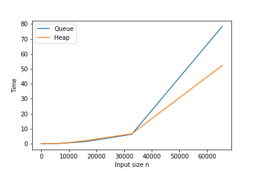

# Homework: Weighted Graps
### Plasencia Palacios Milton Nicolás

#### Exercise 1
The array-based inmplementation for Dijkstra's algorithm is found in the "graph.c" file in the "src" folder (name of function: 'dijkstra_queue').
I've implemented the suggested functions in the pdf "08_weighted_graphs", apart from the function "find_nodes" which is used to find the "neighbour" of a given node by searching for them in the adjacency matrix.

#### Exercise 2
The heap-based implementation for Dijkstra's algorithm is found in the "graph.c" file in the "src" folder (name of function: 'dijkstra_heap'). Here the implementation of that function is almost the same of the queue version, except from the fact that here we are using a Min-Heap. Due to some unexpected errors I've used a not-conventional way to get the root of the heap but it works and I obtain the same results as the queue implementation.

#### Exercise 3

Here I've tested my implementation of Dijkstra's algorithm on queues and on heaps. We can see that from  heap version outperform the queue one and that can be explained using the asymptotic complexity of both implementations:

Queue Dijkstra: )

Heap Dijkstra: 
